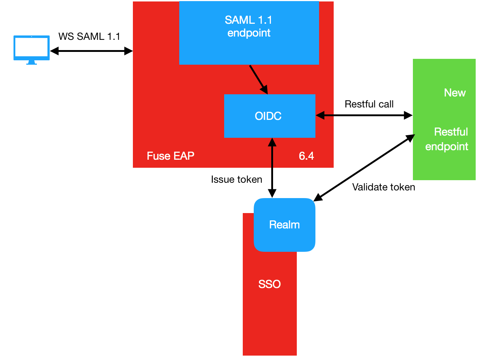

= Example of web-service transformation and modernization  with FUSE and Keycloak

:toc:
:toc-placement!:

toc::[]

author: Nikolaj Majorov <nmajorov (at) redhat.com>

== Architecture
The idea of example is to show how to modernize and transform
SOAP web-service secured with http://saml.xml.org/saml-specifications[WS SAML V1.1]  to be able to talk with
modern Restful web-service and authenticate each call to Restful web service with
http://openid.net/connect/[OpenID Connect] protocoll, so that each SOAP client will get
SOAP response from Restful web-service.

Request flow:

1. In Fuse EAP a camel route will be deployed with cxf-ws service endpoint and it can consume WS SAML 1.1 request.
2. Request get validated at endpoint against custom certificates. (Same as it is now in OSB)
3. Camel route calling SSO to obtain OpenID Connect (OIDC) token and with this token call web service (Rest or can be SOAP as well) in the other network zone.
SSO realm issue  a JWT  token for camel route.
4. Camel route call “New Restful Endpoint” with new issued token from SSO.
The “new  Restful” endpoint will validate token by calling SSO and if the token is valid it will send response to the Fuse route back.
5. Fuse route will send back response to the initial “old SAML 1.1 client”.

Request flow for SAML 1.1 service call in camel route:

== Implementation in details

the camel route located in file:
----
spring-route/src/main/webapp/WEB-INF/cxf-servlet.xml
----

camel route:

[source,xml]
----
....

<camelContext id="my_context" xmlns="http://camel.apache.org/schema/spring">
    <route id="start">
        <from uri="cxf:bean:echoService" />
        <log message="Also Got ${body}" loggingLevel="INFO" />
        <bean ref="restClient" method="callRest" id="bean1"/>
    </route>
</camelContext>

...
----

== SOAP client call

Project **spring-route-client** is the start point for SOAP WS call.

It call SOAP WS located on FUSE-EAP  and ecrypt it with SAML 1.1 token.

Outbound Message:
[source,xml]
----

<?xml version="1.0" encoding="UTF-8"?>
<soap:Envelope xmlns:soap="http://schemas.xmlsoap.org/soap/envelope/">
  <SOAP-ENV:Header xmlns:SOAP-ENV="http://schemas.xmlsoap.org/soap/envelope/">
    <wsse:Security xmlns:wsse="http://docs.oasis-open.org/wss/2004/01/oasis-200401-wss-wssecurity-secext-1.0.xsd" xmlns:wsu="http://docs.oasis-open.org/wss/2004/01/oasis-200401-wss-wssecurity-utility-1.0.xsd" soap:mustUnderstand="1">
      <wsse:BinarySecurityToken EncodingType="http://docs.oasis-open.org/wss/2004/01/oasis-200401-wss-soap-message-security-1.0#Base64Binary" ValueType="http://docs.oasis-open.org/wss/2004/01/oasis-200401-wss-x509-token-profile-1.0#X509v3" wsu:Id="CertId-449ed1cb-6084-4393-b040-67bc169b06c4">MIIBmDCCAQECBEZu1OowDQYJKoZIhvcNAQEEBQAwEjEQMA4GA1UEAxMHbXlBbGlhczAgFw0wNzA2MTIxNzE2MjZaGA80NzQ1MDUwOTE3MTYyNlowEjEQMA4GA1UEAxMHbXlBbGlhczCBnzANBgkqhkiG9w0BAQEFAAOBjQAwgYkCgYEApeOd8EfprmTD+6/nOe3nK3eXFlPsaiRnz5+R3gA6xz4WOOOQX7l1Pa4S65TZmVOxkfPzP+rFvbOJ4sn7ct0EtMiAYuqwnDiHVkqYIhz5WkoPBQet6J7dtcPIAEI9i5Mmf5gsiIMTo8UxqXnsrjCNX6MSrLFr2yspdR/xFYK5IqkCAwEAATANBgkqhkiG9w0BAQQFAAOBgQB/nqtFF6u4FJI90JS+RogSTYFc9mngpvXv8WJsfdR+IQovdFjzqCufOAGPctuq6olgW1A5DRNLIQwr7sIPUhHBFZssuggwEQtF/lvJ51MGhp+pqySbpcPo31WppQO+t4Zsu78DZO4GB3Njr1MqOnux5gPGHftujzlJh31SpkEfjA==</wsse:BinarySecurityToken>
      <saml1:Assertion xmlns:saml1="urn:oasis:names:tc:SAML:1.0:assertion" xmlns:xsi="http://www.w3.org/2001/XMLSchema-instance" AssertionID="_e3bec1aa-32dc-46c5-b920-63e2b76b26d6" IssueInstant="2018-02-16T11:51:37.511Z" Issuer="www.example.com" MajorVersion="1" MinorVersion="1" xsi:type="saml1:AssertionType">
        <saml1:Conditions NotBefore="2018-02-16T11:51:37.946Z" NotOnOrAfter="2018-02-16T11:56:37.946Z"/>
        <saml1:AuthenticationStatement AuthenticationInstant="2018-02-16T11:51:37.933Z" AuthenticationMethod="urn:oasis:names:tc:SAML:1.0:am:password" xsi:type="saml1:AuthenticationStatementType">
          <saml1:Subject>
            <saml1:NameIdentifier Format="urn:oasis:names:tc:SAML:1.1:nameid-format:unspecified" NameQualifier="www.example.com">uid=alice,ou=people,ou=saml-demo,o=example.com</saml1:NameIdentifier>
            <saml1:SubjectConfirmation>
              <saml1:ConfirmationMethod>urn:oasis:names:tc:SAML:1.0:cm:sender-vouches</saml1:ConfirmationMethod>
            </saml1:SubjectConfirmation>
          </saml1:Subject>
        </saml1:AuthenticationStatement>
      </saml1:Assertion>
      <wsse:SecurityTokenReference xmlns:wsse11="http://docs.oasis-open.org/wss/oasis-wss-wssecurity-secext-1.1.xsd" wsse11:TokenType="http://docs.oasis-open.org/wss/oasis-wss-saml-token-profile-1.1#SAMLV1.1" wsu:Id="STRSAMLId-27ae41bf-2995-4c95-82ff-2e492e5fe007">
        <wsse:KeyIdentifier ValueType="http://docs.oasis-open.org/wss/oasis-wss-saml-token-profile-1.0#SAMLAssertionID">_e3bec1aa-32dc-46c5-b920-63e2b76b26d6</wsse:KeyIdentifier>
      </wsse:SecurityTokenReference>
      <ds:Signature xmlns:ds="http://www.w3.org/2000/09/xmldsig#" Id="SIG-a4c1ab2b-77ba-45bd-8114-58ef691bcc23">
        <ds:SignedInfo>
          <ds:CanonicalizationMethod Algorithm="http://www.w3.org/2001/10/xml-exc-c14n#">
            <ec:InclusiveNamespaces xmlns:ec="http://www.w3.org/2001/10/xml-exc-c14n#" PrefixList="soap"/>
          </ds:CanonicalizationMethod>
          <ds:SignatureMethod Algorithm="http://www.w3.org/2000/09/xmldsig#rsa-sha1"/>
          <ds:Reference URI="#id-3991ba28-2781-4c41-b2d9-3b73e0544691">
            <ds:Transforms>
              <ds:Transform Algorithm="http://www.w3.org/2001/10/xml-exc-c14n#"/>
            </ds:Transforms>
            <ds:DigestMethod Algorithm="http://www.w3.org/2000/09/xmldsig#sha1"/>
            <ds:DigestValue>VQ/k4/1I6Cyw4XBJWILQ87sFi1Y=</ds:DigestValue>
          </ds:Reference>
          <ds:Reference URI="#STRSAMLId-27ae41bf-2995-4c95-82ff-2e492e5fe007">
            <ds:Transforms>
              <ds:Transform Algorithm="http://docs.oasis-open.org/wss/2004/01/oasis-200401-wss-soap-message-security-1.0#STR-Transform">
                <wsse:TransformationParameters>
                  <ds:CanonicalizationMethod Algorithm="http://www.w3.org/2001/10/xml-exc-c14n#"/>
                </wsse:TransformationParameters>
              </ds:Transform>
            </ds:Transforms>
            <ds:DigestMethod Algorithm="http://www.w3.org/2000/09/xmldsig#sha1"/>
            <ds:DigestValue>aAbdlRe6nBu7GfbYkVGAEY53DCc=</ds:DigestValue>
          </ds:Reference>
        </ds:SignedInfo>
        <ds:SignatureValue>RnwwqwlVyBG9PON5B/mufjLx+5SLW7E1qIgerpjgwG3O024nOdn23I+IRa4aunHSaAKfIWhOi0/xLUD36g3M5sWMIw3Px2r8bbdIWQlV1HW2mf0Wqzj/w622TC0FFDeXnLZYMbRw78+Yx9VZopjhM/nC1yyzgRRgzFEgD3y7NMQ=</ds:SignatureValue>
        <ds:KeyInfo Id="KeyId-1496c67e-3128-4a4a-9c92-a3b7a146f465">
          <wsse:SecurityTokenReference wsu:Id="STRId-daf567e5-b059-4b2b-ab3c-e1eba8f9c4ac">
            <wsse:Reference URI="#CertId-449ed1cb-6084-4393-b040-67bc169b06c4" ValueType="http://docs.oasis-open.org/wss/2004/01/oasis-200401-wss-x509-token-profile-1.0#X509v3"/>
          </wsse:SecurityTokenReference>
        </ds:KeyInfo>
      </ds:Signature>
    </wsse:Security>
  </SOAP-ENV:Header>
  <soap:Body xmlns:wsu="http://docs.oasis-open.org/wss/2004/01/oasis-200401-wss-wssecurity-utility-1.0.xsd" wsu:Id="id-3991ba28-2781-4c41-b2d9-3b73e0544691">
    <ns2:echo xmlns:ns2="http://ws.consulting.redhat.com">
      <arg0>hey ho snow</arg0>
    </ns2:echo>
  </soap:Body>
</soap:Envelope>

----

Inbound message:

[source,xml]
----
<?xml version="1.0" encoding="UTF-8"?>
<soap:Envelope xmlns:soap="http://schemas.xmlsoap.org/soap/envelope/">
  <soap:Header>
    <wsse:Security soap:mustUnderstand="1" xmlns:SOAP-ENV="http://schemas.xmlsoap.org/soap/envelope/" xmlns:soap="http://schemas.xmlsoap.org/soap/envelope/" xmlns:wsse="http://docs.oasis-open.org/wss/2004/01/oasis-200401-wss-wssecurity-secext-1.0.xsd" xmlns:wsu="http://docs.oasis-open.org/wss/2004/01/oasis-200401-wss-wssecurity-utility-1.0.xsd">
      <wsse:BinarySecurityToken EncodingType="http://docs.oasis-open.org/wss/2004/01/oasis-200401-wss-soap-message-security-1.0#Base64Binary" ValueType="http://docs.oasis-open.org/wss/2004/01/oasis-200401-wss-x509-token-profile-1.0#X509v3" wsu:Id="CertId-449ed1cb-6084-4393-b040-67bc169b06c4">MIIBmDCCAQECBEZu1OowDQYJKoZIhvcNAQEEBQAwEjEQMA4GA1UEAxMHbXlBbGlhczAgFw0wNzA2MTIxNzE2MjZaGA80NzQ1MDUwOTE3MTYyNlowEjEQMA4GA1UEAxMHbXlBbGlhczCBnzANBgkqhkiG9w0BAQEFAAOBjQAwgYkCgYEApeOd8EfprmTD+6/nOe3nK3eXFlPsaiRnz5+R3gA6xz4WOOOQX7l1Pa4S65TZmVOxkfPzP+rFvbOJ4sn7ct0EtMiAYuqwnDiHVkqYIhz5WkoPBQet6J7dtcPIAEI9i5Mmf5gsiIMTo8UxqXnsrjCNX6MSrLFr2yspdR/xFYK5IqkCAwEAATANBgkqhkiG9w0BAQQFAAOBgQB/nqtFF6u4FJI90JS+RogSTYFc9mngpvXv8WJsfdR+IQovdFjzqCufOAGPctuq6olgW1A5DRNLIQwr7sIPUhHBFZssuggwEQtF/lvJ51MGhp+pqySbpcPo31WppQO+t4Zsu78DZO4GB3Njr1MqOnux5gPGHftujzlJh31SpkEfjA==</wsse:BinarySecurityToken>
      <saml1:Assertion xmlns:saml1="urn:oasis:names:tc:SAML:1.0:assertion" xmlns:xsi="http://www.w3.org/2001/XMLSchema-instance" AssertionID="_e3bec1aa-32dc-46c5-b920-63e2b76b26d6" IssueInstant="2018-02-16T11:51:37.511Z" Issuer="www.example.com" MajorVersion="1" MinorVersion="1" xsi:type="saml1:AssertionType">
        <saml1:Conditions NotBefore="2018-02-16T11:51:37.946Z" NotOnOrAfter="2018-02-16T11:56:37.946Z"/>
        <saml1:AuthenticationStatement AuthenticationInstant="2018-02-16T11:51:37.933Z" AuthenticationMethod="urn:oasis:names:tc:SAML:1.0:am:password" xsi:type="saml1:AuthenticationStatementType">
          <saml1:Subject>
            <saml1:NameIdentifier Format="urn:oasis:names:tc:SAML:1.1:nameid-format:unspecified" NameQualifier="www.example.com">uid=alice,ou=people,ou=saml-demo,o=example.com</saml1:NameIdentifier>
            <saml1:SubjectConfirmation>
              <saml1:ConfirmationMethod>urn:oasis:names:tc:SAML:1.0:cm:sender-vouches</saml1:ConfirmationMethod>
            </saml1:SubjectConfirmation>
          </saml1:Subject>
        </saml1:AuthenticationStatement>
      </saml1:Assertion>
      <wsse:SecurityTokenReference xmlns:wsse11="http://docs.oasis-open.org/wss/oasis-wss-wssecurity-secext-1.1.xsd" wsse11:TokenType="http://docs.oasis-open.org/wss/oasis-wss-saml-token-profile-1.1#SAMLV1.1" wsu:Id="STRSAMLId-27ae41bf-2995-4c95-82ff-2e492e5fe007">
        <wsse:KeyIdentifier ValueType="http://docs.oasis-open.org/wss/oasis-wss-saml-token-profile-1.0#SAMLAssertionID">_e3bec1aa-32dc-46c5-b920-63e2b76b26d6</wsse:KeyIdentifier>
      </wsse:SecurityTokenReference>
      <ds:Signature xmlns:ds="http://www.w3.org/2000/09/xmldsig#" Id="SIG-a4c1ab2b-77ba-45bd-8114-58ef691bcc23">
        <ds:SignedInfo>
          <ds:CanonicalizationMethod Algorithm="http://www.w3.org/2001/10/xml-exc-c14n#">
            <ec:InclusiveNamespaces xmlns:ec="http://www.w3.org/2001/10/xml-exc-c14n#" PrefixList="soap"/>
          </ds:CanonicalizationMethod>
          <ds:SignatureMethod Algorithm="http://www.w3.org/2000/09/xmldsig#rsa-sha1"/>
          <ds:Reference URI="#id-3991ba28-2781-4c41-b2d9-3b73e0544691">
            <ds:Transforms>
              <ds:Transform Algorithm="http://www.w3.org/2001/10/xml-exc-c14n#"/>
            </ds:Transforms>
            <ds:DigestMethod Algorithm="http://www.w3.org/2000/09/xmldsig#sha1"/>
            <ds:DigestValue>VQ/k4/1I6Cyw4XBJWILQ87sFi1Y=</ds:DigestValue>
          </ds:Reference>
          <ds:Reference URI="#STRSAMLId-27ae41bf-2995-4c95-82ff-2e492e5fe007">
            <ds:Transforms>
              <ds:Transform Algorithm="http://docs.oasis-open.org/wss/2004/01/oasis-200401-wss-soap-message-security-1.0#STR-Transform">
                <wsse:TransformationParameters>
                  <ds:CanonicalizationMethod Algorithm="http://www.w3.org/2001/10/xml-exc-c14n#"/>
                </wsse:TransformationParameters>
              </ds:Transform>
            </ds:Transforms>
            <ds:DigestMethod Algorithm="http://www.w3.org/2000/09/xmldsig#sha1"/>
            <ds:DigestValue>aAbdlRe6nBu7GfbYkVGAEY53DCc=</ds:DigestValue>
          </ds:Reference>
        </ds:SignedInfo>
        <ds:SignatureValue>RnwwqwlVyBG9PON5B/mufjLx+5SLW7E1qIgerpjgwG3O024nOdn23I+IRa4aunHSaAKfIWhOi0/xLUD36g3M5sWMIw3Px2r8bbdIWQlV1HW2mf0Wqzj/w622TC0FFDeXnLZYMbRw78+Yx9VZopjhM/nC1yyzgRRgzFEgD3y7NMQ=</ds:SignatureValue>
        <ds:KeyInfo Id="KeyId-1496c67e-3128-4a4a-9c92-a3b7a146f465">
          <wsse:SecurityTokenReference wsu:Id="STRId-daf567e5-b059-4b2b-ab3c-e1eba8f9c4ac">
            <wsse:Reference URI="#CertId-449ed1cb-6084-4393-b040-67bc169b06c4" ValueType="http://docs.oasis-open.org/wss/2004/01/oasis-200401-wss-x509-token-profile-1.0#X509v3"/>
          </wsse:SecurityTokenReference>
        </ds:KeyInfo>
      </ds:Signature>
    </wsse:Security>
  </soap:Header>
  <soap:Body>
    <ns2:echoResponse xmlns:ns2="http://ws.consulting.redhat.com">
      <return>Hello from WildFly Swarm!</return>
    </ns2:echoResponse>
  </soap:Body>
</soap:Envelope>

----

Response :
----
get responce: Hello from WildFly Swarm!
----

indicate that response comming from RESTful service running behind FUSE
on  wildfly.swarm instance.
The  web-service call was passed throw camel-route:

1.  Inbound payload was checked for SOAP SAML 1.1 token
2. it was  authorized over  keycloak realm, which issued an OIDC token.
3.  RESTful Web Service was called with Bearer token.
4.  Response from RESTful web-service was passed to the original SOAP web-service client
 plus it was  wrapped and signed with SAML1.1
